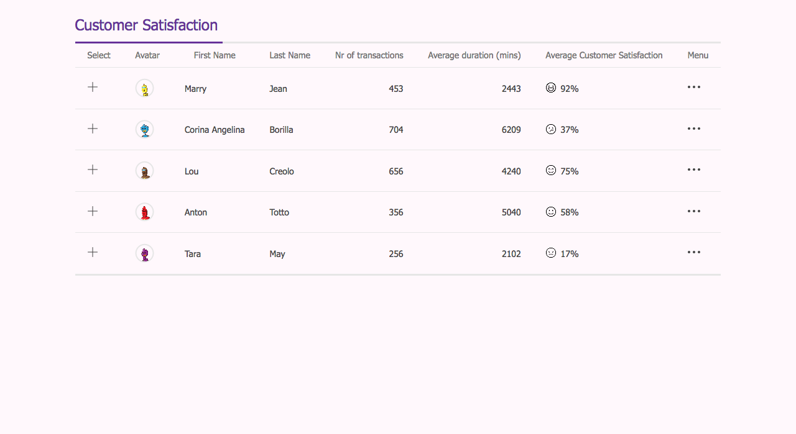
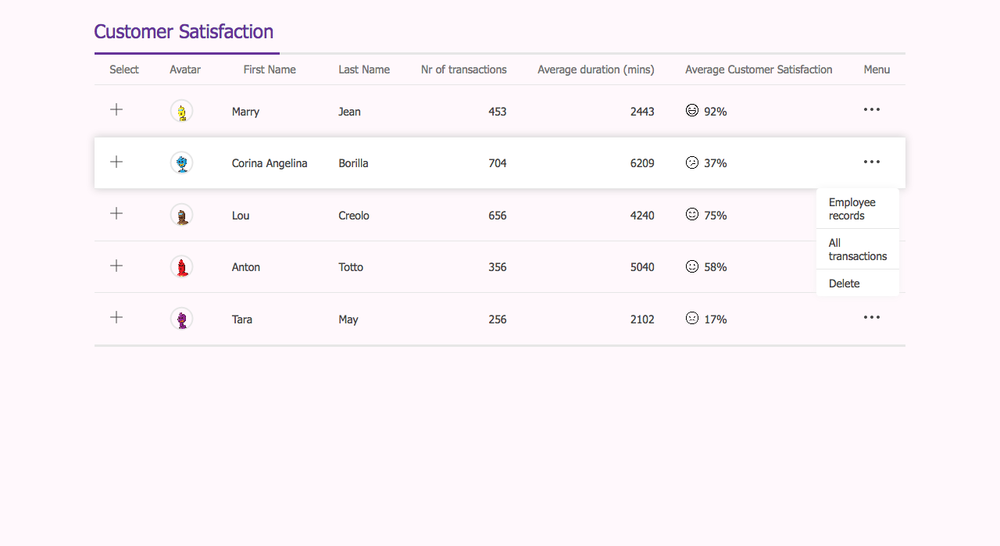
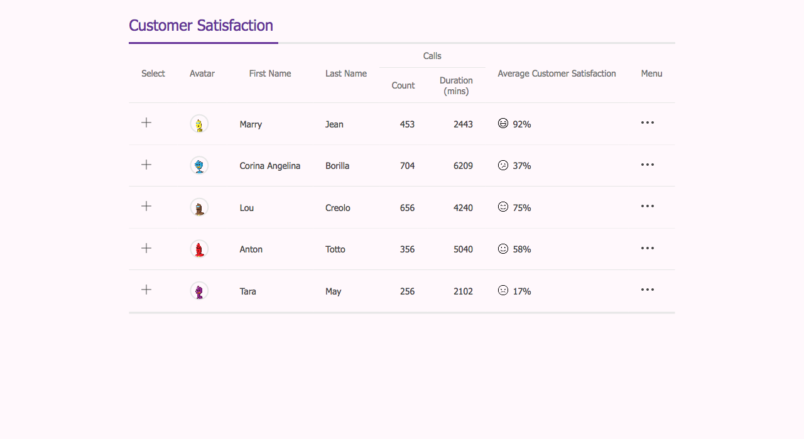

# Dashboard zur Kundenzufriedenheit

Nutze alles, was wir in diesem Modul gelernt haben, um ein Dashboard zur Kundenzufriedenheit zu erstellen, wie im folgenden Mockup gezeigt:

### Spezifikationen

> - zentriert auf der Seite
> - Kopfzeile (header) mit Unterstreichungseffekt (underline effect)
> - Zufriedenheitsnummer mit Symbol (Icon) -> vertikal zentriert
> - Mitarbeiter-Avatar
> - Spalten, die Zahlen enthalten, sind rechtsbündig
> - es gibt einen Hover-Effekt, wenn man mit dem Mauszeiger über verschiedene Zeilen fährt
> - Dropdown beim Hovern des Symbols

Beispiel für den Hover-Effekt im Kundenzufriedenheits-Dashboard

#### Optional

- Sticky Header -> sieh dir an, welche Probleme du bekommen könntest
- Responsive -> kein Überlauf der gesamten Seite
- Geteilte Spaltenüberschrift

Beispiel für eine geteilte Kopfzeile im Kundenzufriedenheits-Dashboard

> Hinweis: Du kannst `https://robohash.org/` für die Avatar-Bilder verwenden.
> Gib einen beliebigen String nach der URL an, um einen zufälligen Roboter-Avatar zu erhalten:
> `https://robohash.org/marry` oder `https://robohash.org/lou` oder sogar `https://robohash.org/fghjklhgfhj`.
